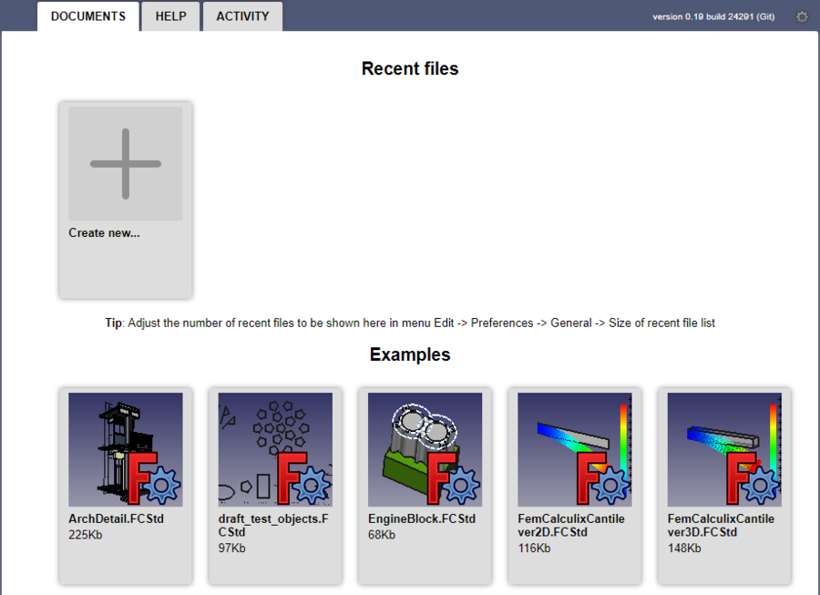
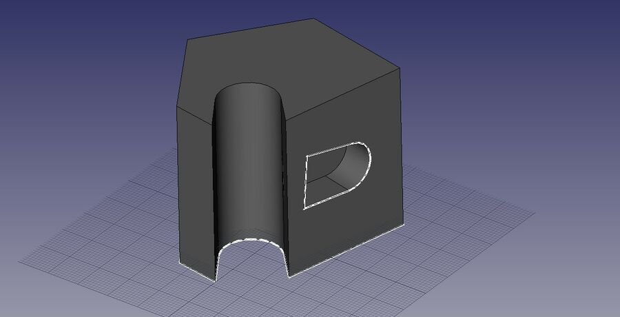
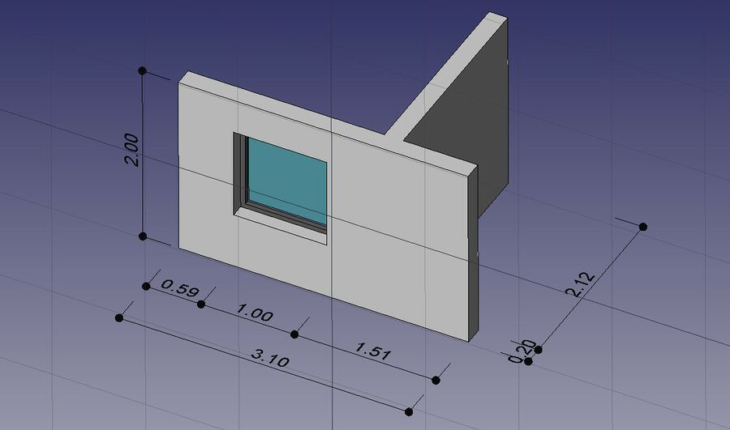

# 开始

## 前言

FreeCAD is a 3D [parametric modeling application](https://wiki.freecad.org/About_FreeCAD). It is primarily made for mechanical design, but also serves all other uses where you need to model 3D objects with precision and control over modeling history.

FreeCAD has been under development since 2002, and it offers a large list of [features](https://wiki.freecad.org/Feature_list). Capabilities are still missing but it is powerful enough for hobbyist use, and small workshops. There is a fast-growing community of enthusiastic users who participate in the [FreeCAD forum](http://forum.freecadweb.org/index.php), and you can find [many examples](https://forum.freecadweb.org/viewforum.php?f=24) of quality projects developed with FreeCAD there. See also, [FreeCAD used in production](https://wiki.freecad.org/FreeCAD_used_in_production).

Like all free software projects, FreeCAD depends on its community to grow, gain features, and fix bugs. Don't forget this when using FreeCAD; if you like it, you can [donate](https://wiki.freecad.org/Donate) and [help FreeCAD](https://wiki.freecad.org/Help_FreeCAD) in various ways, such as writing documentation and making translations.

See also:

- [Migrating to FreeCAD from Fusion360](https://wiki.freecad.org/Migrating_to_FreeCAD_from_Fusion360)
- [Which workbench should I choose?](https://wiki.freecad.org/Which_workbench_should_I_choose)
- [Tutorials](Tutorials)
- [Video tutorials](https://wiki.freecad.org/Video_tutorials)

## 安装

First of all, download and install FreeCAD. See the [Download](https://wiki.freecad.org/Download) page for information on current versions and updates, and the installation instructions for you operating system ([Windows](https://wiki.freecad.org/Installing_on_Windows), [Linux](https://wiki.freecad.org/Installing_on_Linux) or [Mac](https://wiki.freecad.org/Installing_on_Mac)). There are install packages ready for Windows (.msi), Debian and Ubuntu (.deb), openSUSE (.rpm), and Mac OSX. FreeCAD is available from the package managers of many other Linux distributions. A standalone [AppImage](https://wiki.freecad.org/AppImage) executable is also available, which will run on most recent 64-bit Linux systems. As FreeCAD is open-source, you can also grab the source code and [compile](https://wiki.freecad.org/Compiling) it yourself.

## 探索界面

  
_标准的 FreeCAD 接口_

_完整的解释见[界面](https://wiki.freecad.org/Interface)._

1.  [主视图区](https://wiki.freecad.org/Main_view_area), 可以包含不同的选项卡窗口，主要是[3D 视图](https://wiki.freecad.org/3D_view).
2.  [3D 视图](https://wiki.freecad.org/3D_view), 显示文档中的几何对象。
3.  [树视图](https://wiki.freecad.org/Tree_view) (部分[组合视图](https://wiki.freecad.org/Combo_view)), 显示文档中对象的层次结构和构建历史;它还可以显示活动命令的[任务面板](https://wiki.freecad.org/Task_panel)。
4.  [属性编辑器](https://wiki.freecad.org/Property_editor) (部分[组合视图](https://wiki.freecad.org/Combo_view)), 允许查看和修改所选对象的属性。
5.  [选择视图](https://wiki.freecad.org/Selection_view), 表示被选中的对象或对象的子元素(顶点、边、面)。
6.  [报告视图](https://wiki.freecad.org/Report_view) (或者输出窗口), 其中显示消息、警告和错误。
7.  [Python 控制台](https://wiki.freecad.org/Python_console), 其中打印所有执行的命令，您可以在其中输入[Python](https://wiki.freecad.org/Python)代码。
8.  [状态栏](https://wiki.freecad.org/Status_bar), 显示一些消息和工具提示的地方。
9.  工具栏区域，工具栏停靠在这里。
10. [工作台选择器](https://wiki.freecad.org/Std_Workbench), 选择活动的[工作台](https://wiki.freecad.org/Workbenches).
11. [标准菜单](https://wiki.freecad.org/Standard_Menu), 它包含程序的基本操作。

The main concept behind the FreeCAD interface is that it is separated into [workbenches](https://wiki.freecad.org/Workbenches). A workbench is a collection of tools suited for a specific task, such as working with [meshes](https://wiki.freecad.org/Mesh_Workbench), or drawing [2D objects](https://wiki.freecad.org/Draft_Workbench), or [constrained sketches](https://wiki.freecad.org/Sketcher_Workbench). You can switch the current workbench with the [workbench selector](https://wiki.freecad.org/Std_Workbench). You can [customize](https://wiki.freecad.org/Interface_Customization) the tools included in each workbench, add tools from other workbenches or even self-created tools, that we call [macros](https://wiki.freecad.org/Macros). Widely used starting points are the [PartDesign Workbench](https://wiki.freecad.org/PartDesign_Workbench) and [Part Workbench](https://wiki.freecad.org/Part_Workbench).

When you start FreeCAD for the first time, you are presented with the Start page. Here is what it looks like for version 0.19:  
  
The Start page allows you to quickly jump to one of the most common workbenches, open one of the recent files, or see the latest news from the FreeCAD world. You can change the default workbench in the [preferences](https://wiki.freecad.org/Preferences_Editor).

## 在 3D 空间中导航

FreeCAD has several [navigation modes](https://wiki.freecad.org/Mouse_navigation) available, that change the way you use your mouse to interact with the objects in the 3D view and the view itself. One of them is specifically made for [touchpads](https://wiki.freecad.org/Mouse_navigation#Touchpad_navigation), where the middle mouse button is not used. The default navigation mode is [CAD navigation](https://wiki.freecad.org/Mouse_navigation#CAD_navigation). You can quickly change the current navigation mode by using the  button in the [Status bar](https://wiki.freecad.org/Status_bar) or by right-clicking an empty area of the [3D view](https://wiki.freecad.org/3D_view).

You also have several view presets (top view, front view, etc) available in the View menu, on the View toolbar, and by numeric shortcuts (1, 2, etc...). By right-clicking on an object or on an empty area of the 3D view, you have quick access to some common operations, such as setting a particular view, or locating an object in the Tree view.

## 使用 FreeCAD 的第一步

FreeCAD's focus is to allow you to make high-precision 3D models, to keep tight control over those models (being able to go back into modelling history and change parameters), and eventually to build those models (via 3D printing, CNC machining or even construction worksite). It is therefore very different from some other 3D applications made for other purposes, such as animation film or gaming. Its learning curve can be steep, especially if this is your first contact with 3D modeling. If you are stuck at some point, don't forget that the friendly community of users on the [FreeCAD forum](http://forum.freecadweb.org/index.php) might be able to get you out in no time.

The workbench you will start using in FreeCAD depends on the type of job you need to do: If you are going to work on mechanical models, or more generally any small-scale objects, you'll probably want to try the [PartDesign Workbench](https://wiki.freecad.org/PartDesign_Workbench). If you will work in 2D, then switch to the [Draft Workbench](https://wiki.freecad.org/Draft_Workbench), or the [Sketcher Workbench](https://wiki.freecad.org/Sketcher_Workbench) if you need constraints. If you want to do BIM, launch the [Arch Workbench](https://wiki.freecad.org/Arch_Workbench). And if you come from the OpenSCAD world, try the [OpenSCAD Workbench](https://wiki.freecad.org/OpenSCAD_Workbench). There are also many community-developed [external workbenches](https://wiki.freecad.org/External_workbenches) available.

You can switch workbenches at any time, and also [customize](https://wiki.freecad.org/Interface_Customization) your favorite workbench to add tools from other workbenches.

## 使用 PartDesign 和 Sketcher 工作台

The [PartDesign Workbench](https://wiki.freecad.org/PartDesign_Workbench) is made to build complex objects, starting from simple shapes, and adding or removing pieces (called "features"), until you get to your final object. All the features you applied during the modelling process are stored in a separate view called the [tree view](https://wiki.freecad.org/Document_structure), which also contains the other objects in your document. You can think of a PartDesign object as a succession of operations, each one applied to the result of the preceding one, forming one big chain. In the tree view, you see your final object, but you can expand it and retrieve all preceding states, and change any of their parameter, which automatically updates the final object.

The PartDesign workbench makes heavy use of another workbench, the [Sketcher Workbench](https://wiki.freecad.org/Sketcher_Workbench). The sketcher allows you to draw 2D shapes, which are defined by applying Constraints to the 2D shape. For example, you might draw a rectangle and set the size of a side by applying a length constraint to one of the sides. That side then cannot be resized anymore (unless the constraint is changed).

Those 2D shapes made with the sketcher are used a lot in the PartDesign workbench, for example to create 3D volumes, or to draw areas on the faces of your object that will then be hollowed from its main volume. This is a typical PartDesign workflow:

1. Create a new sketch
2. Draw a closed shape (make sure all points are joined)
3. Close the sketch
4. Expand the sketch into a 3D solid by using the pad tool
5. Select one face of the solid
6. Create a second sketch (this time it will be drawn on the selected face)
7. Draw a closed shape
8. Close the sketch
9. Create a pocket from the second sketch, on the first object

Which gives you an object like this:  
  
At any moment, you can select the original sketches and modify them, or change the extrusion parameters of the pad or pocket operations, which will update the final object.

## 使用 Draft 和 Arch 工作台

The [Draft Workbench](https://wiki.freecad.org/Draft_Workbench) and [Arch Workbench](https://wiki.freecad.org/Arch_Workbench) behave a bit differently than the other workbenches above, although they follow the same rules, which are common to all of FreeCAD. In short, while the Sketcher and PartDesign are made primarily to design single pieces, Draft and Arch are made to ease your work when working with several, simpler objects.

The [Draft Workbench](https://wiki.freecad.org/Draft_Workbench) offers you 2D tools somewhat similar to what you can find in traditional 2D CAD applications such as [AutoCAD](https://en.wikipedia.org/wiki/AutoCAD). However, 2D drafting being far away from the scope of FreeCAD, don't expect to find there the full array of tools that these dedicated applications offer. Most of the Draft tools work not only in a 2D plane but also in the full 3D space, and benefit from special helper systems such as [Work planes](https://wiki.freecad.org/Draft_SelectPlane) and [object snapping](https://wiki.freecad.org/Draft_Snap).

The [Arch Workbench](https://wiki.freecad.org/Arch_Workbench) adds [BIM](http://en.wikipedia.org/wiki/Building_Information_Modeling) tools to FreeCAD, allowing you to build architectural models with parametric objects. The Arch workbench relies extensively on other modules such as Draft and Sketcher. All the Draft tools are also present in the Arch workbench, and most Arch tools make use of the Draft helper systems.

A typical workflow with Arch and Draft workbenches might be:

1. Draw a couple of lines with the Draft Line tool
2. Select each line and press the Wall tool to build a wall on each of them
3. Join the walls by selecting them and pressing the Arch Add tool
4. Create a floor object, and move your walls in it from the Tree view
5. Create a building object, and move your floor in it from the Tree view
6. Create a window by clicking the Window tool, select a preset in its panel, then click on a face of a wall
7. Add dimensions by first setting the working plane if necessary, then using the Draft Dimension tool

Which will give you this:  

More on the [Tutorials](https://wiki.freecad.org/Tutorials) page.

## 插件，宏和外部工作台

FreeCAD, as an open source software, offers the possibility to supplement its workbenches with addons.

The [Addon](https://wiki.freecad.org/Addon) principle is based on the development of a workbench complement. Any user can develop a function that he or she deems to be missing for her/his own needs or, ultimately, for the community. With the forum, the user can request an opinion, help on the forum. It can share, or not, the object of its development according to copyright rules to define. Free to her/him. To develop, the user has available [scripting](https://wiki.freecad.org/Scripting) functions.

There are two types of addons:

1. [Macros](https://wiki.freecad.org/Macros): short snippets of Python code that provide a new tool or functionality. Macros usually start as a way to simplify or automate the task of drawing or editing a particular object. If many of these macros are collected inside a directory, the entire directory may be distributed as a new workbench.
2. [External workbenches](https://wiki.freecad.org/External_workbenches): collections of tools programmed in Python or C++ that extend FreeCAD in an important way. If a workbench is sufficiently developed and is well documented, it may be included as one of the base workbenches in FreeCAD. Under [External workbenches](https://wiki.freecad.org/External_workbenches), you'll find the principle and a list of existing library.

## 脚本

And finally, one of the most powerful features of FreeCAD is the [scripting](https://wiki.freecad.org/Scripting) environment. From the integrated python console (or from any other external Python script), you can gain access to almost any part of FreeCAD, create or modify geometry, modify the representation of those objects in the 3D scene or access and modify the FreeCAD interface. Python scripting can also be used in [macros](https://wiki.freecad.org/Macros), which provide an easy method to create custom commands.

## 有什么新鲜事

- See the [release notes](https://wiki.freecad.org/Feature_list#Release_notes) for the detailed list of features.
